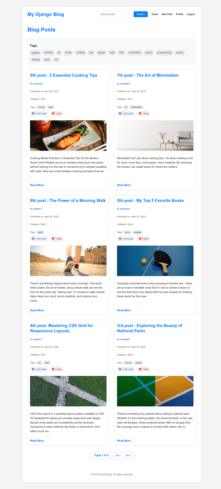

# Django Blog Platform

<div align="center">
  


</div>

<div align="center">
  
  <p><em>Modern Django blog platform with featured posts carousel and dark mode support</em></p>
</div>

## 📜 Overview

📖 Overview

This project is a fully-featured blogging platform built using the Django framework. It is designed to replicate the functionality of professional blogging systems while keeping the codebase structured, scalable, and easy to extend.

It includes everything you would expect in a modern blog: user authentication, profile management, CRUD operations for posts, categories, and tags, comments with threaded replies, likes, dark mode, responsive design, search, featured posts carousel, and analytics features like post views and reading time estimation.

The goal of this project is not just to provide a blogging system but to also serve as a comprehensive example of Django best practices, including clean architecture, efficient database queries, use of AJAX for interactivity, and modern frontend patterns.

## ✨ Features

### Core Blogging Features

📝 Create, edit, delete, and view blog posts

📂 Organize posts by categories and tags

📷 Upload images with posts for a rich content experience

📄 Pagination on listing pages (blog list, search results, author profiles)
- 👤 Complete user authentication (register, login, logout)
- 👥 User profiles with customizable bio and profile picture
- 🔒 Permission-based access (only authors can edit their own posts)
- 📷 Upload and display images for each blog post
- 💬 Moderated commenting system with nested replies
- ❤️ Like system for posts and comments with real-time feedback
- 🏷️ Tag system for organizing and discovering related content
- 🎨 Clean, minimal, and responsive design with a two-column layout
- 📱 Mobile-friendly interface for reading on any device
- ⏱️ Reading time estimator for each post
- 👁️ Post view counter that tracks unique visitor views
- 🌓 Dark Mode Toggle with persistent user preference
- 🎠 **NEW: Featured Posts Carousel with auto-rotation and navigation**

### Featured Posts Carousel
- 🔄 Automatically rotates through featured posts with smooth transitions
- ⏱️ Customizable timing for transitions (default: 6 seconds)
- 🖱️ Pause on hover functionality to improve user experience
- 🎯 Navigation controls (prev/next buttons and indicator dots)
- 📊 Progress bar showing time until next slide
- 📱 Fully responsive design that adapts to all screen sizes
- 🎨 Side-by-side layout with content on left, image on right
- 📄 Integrated with admin interface for easy management

### View Counter Feature
- 👁️ Track how many times each post has been viewed
- 📊 Display view counts on all post listings and detail pages
- 🔒 Session-based tracking to prevent duplicate counts
- 📈 Admin dashboard shows view statistics
- 🧠 Helps authors understand their most popular content

### Dark Mode Feature
- 🌗 Seamless toggle between light and dark themes
- 💾 Theme preference saved in localStorage
- 🎨 CSS variables for consistent theming
- 🔄 Smooth transitions when switching themes
- 📱 Respects system dark mode preferences
- 👁️ Reduced eye strain for night reading
- ♿ Improved accessibility

### User Authentication
- ✅ Register new accounts with email verification
- 🔑 Secure login and session management
- 👤 Personalized user profiles
- 🖼️ Profile picture upload
- 🔗 Custom website URL for each user
- 📝 Bio section for users to describe themselves

### Post Management
- 📝 Create new posts with title, content, category, image, and tags
- ✏️ Edit your own posts
- 🗑️ Delete your own posts
- 👁️ View posts by specific authors
- 🏷️ Categorize posts for better organization
- 🔖 Add multiple tags to posts for more precise content organization

### Like System
- ❤️ Like and unlike posts and comments with visual feedback
- 👍 AJAX-based liking without page refresh
- 📊 Display of like counts on all post listings and detail pages
- 👀 Indication of whether current user has liked content
- 🔒 Authentication required for liking (redirects to login if needed)
- 🛡️ Protection against duplicate likes from the same user
- 🔢 Optimized database queries for efficient like count display

### Tag System
- 🏷️ Tag cloud displaying popular tags based on usage
- 🔍 Filter posts by clicking on tags
- 🔄 Related posts suggestion based on shared tags
- 📊 Tag cloud visualization with size based on popularity
- 🔠 Easy-to-use comma-separated tag input when creating/editing posts

### Reading Time Estimator
- ⏱️ Automatically calculates and displays reading time for each post
- 📚 Based on word count and average reading speed
- 🧠 Helps users decide whether they have time to read a post
- 📊 Displays the estimated time prominently on both list and detail views

### Search Functionality
- 🔍 Search for posts by title, content, author name, or tags
- 📊 Dedicated search results page with user-friendly layout
- 🔄 Search form accessible from any page in the header
- 💬 Clear feedback on search results and counts

### Comment System
- 💬 User commenting on blog posts
- 🧵 Threaded comments with reply functionality
- 👮 Comment moderation (admin approval required)
- 🗑️ Comment deletion (users can only delete their own comments)
- 👑 Admin control over all comments through the Django admin

### Pagination
- 📄 Post listings divided into manageable pages (6 posts per page)
- 🔢 Intuitive page navigation with first/previous/next/last controls
- 🔍 Maintains search parameters when navigating between results pages
- 📱 Responsive design that works on all device sizes
- 🧩 Consistent implementation across all listing views (blog list, profiles, search)


User Accounts & Profiles

👤 Secure user registration and login

✏️ Editable profile page with bio, profile picture, and website URL

🔑 Permission-based editing (users can only manage their own posts)

Comments & Social Features

💬 Nested (threaded) commenting system

👮 Admin approval required for moderation

❤️ Like/unlike functionality for posts and comments (AJAX-powered for real-time feedback)

Interactive Features

🔍 Search across titles, content, tags, and authors

🎠 Featured Posts Carousel to highlight key content

👁️ Post view counter with session-based unique tracking

⏱️ Reading time estimation per post

UI & Accessibility

🎨 Minimal and clean two-column design

📱 Fully responsive and mobile-friendly

🌓 Dark Mode with persistent preference storage

♿ Accessibility-conscious design choices

## 🛠️ Technologies Used

- **Backend**: Django (Python Web Framework)
- **Frontend**: HTML, CSS, JavaScript (for interactive features)
- **Database**: SQLite (default for Django, included)
- **Image Handling**: Pillow (Python Imaging Library)
- **Authentication**: Django's built-in auth system with custom extensions
- **AJAX**: Fetch API for asynchronous requests (like system)
- **Icons**: Font Awesome for UI icons
- **Theme**: CSS Variables for dark mode implementation
- **Animation**: JavaScript for carousel functionality and smooth transitions

## 🚀 Setup and Installation

Follow these steps to get the Django Blog Platform running on your local machine after cloning the repository.

### Prerequisites

- Python (3.9 or higher)
- pip (Python package installer)
- git (Version control system)

### Installation Steps

#### 1. Clone the Repository

```bash
git clone https://github.com/yourusername/Django-Blog-Platform.git
cd Django-Blog-Platform
```

#### 2. Set up a Virtual Environment

```bash
# Create a virtual environment named 'venv'
python -m venv venv

# Activate the virtual environment
# On Windows:
venv\Scripts\activate
# On macOS/Linux:
source venv/bin/activate
```

#### 3. Install Dependencies

```bash
pip install -r requirements.txt
```

#### 4. Database Setup

```bash
python manage.py migrate
```

#### 5. Create a Superuser

```bash
python manage.py createsuperuser
```

Follow the prompts in your terminal to set the username, email, and password for your admin account.

#### 6. Run the Development Server

```bash
python manage.py runserver
```

The blog will be accessible in your web browser at http://127.0.0.1:8000/. The administration panel, where you can add and manage content, is located at http://127.0.0.1:8000/admin/.

## 📝 Using Featured Posts

The new featured posts carousel is a powerful way to highlight your best content. Here's how to use it:

1. **Marking Posts as Featured**:
   - Log in to the admin panel (/admin/)
   - Go to the Posts section
   - Edit a post you want to feature
   - Check the "Is Featured" checkbox
   - Save the post

2. **Managing Featured Posts**:
   - You can feature multiple posts which will rotate in the carousel
   - Featured posts appear in order of publication date (newest first)
   - You can bulk edit posts to feature/unfeature them using the admin actions

3. **Carousel Behavior**:
   - Posts automatically rotate every 6 seconds
   - Rotation pauses when users hover over the carousel
   - Users can manually navigate using the arrow buttons or indicator dots
   - A progress bar shows time until the next slide

## 🎨 Customization

You can easily customize the carousel behavior and appearance:

1. **Timing**: Adjust the `intervalTime` variable in the JavaScript to change the rotation speed (default: 6000ms)
2. **Height**: Modify the `min-height` of `.carousel-track` in CSS to fit your content needs
3. **Colors**: Update the CSS variables in `:root` to match your brand colors
4. **Layout**: Adjust the flex properties of `.featured-post-content` to change the text/image ratio

## 📈 Future Enhancements

This project provides a solid starting point. Here are some ideas for future development:

- 📊 Analytics dashboard for tracking post views and user engagement
- 📱 Social media sharing buttons
- 🔑 Social authentication options (Google, Facebook, etc.)
- 📧 Email subscription for blog updates
- 🌟 Extended carousel options (different transition effects, autoplay toggle)
- 💻 Syntax highlighting for code snippets
- 📑 Post series/collections functionality
- 🗂️ Archive view by date
- 🎯 Featured or sticky posts

## 📜 License

This project is licensed under the MIT License. You are free to use, modify, and distribute it for personal or commercial projects, provided you include the license notice.

<div align="center">
 <p>🚀 Built with Django and ❤️ by <a href="https://github.com/Nicole9-Sky">Nicole9-Sky</a></p> </div>
